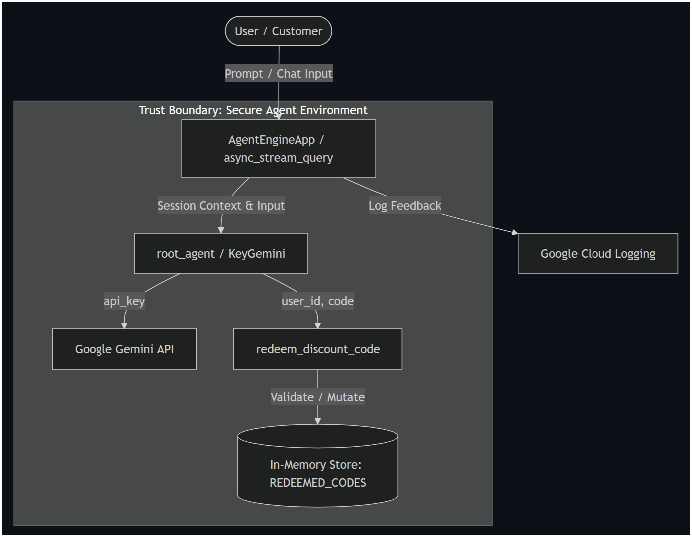

# AI Shopping Assistant



A secure, production-ready AI shopping assistant agent designed to run on the ADK 2.0 platform. It helps customers with product info, shopping queries, and securely handles single-use coupon redemptions.

---

## 🏗️ Project Architecture

```text
shopping-assistant/
├── .agents/                 # Secure coding configuration
│   ├── CONTEXT.md           # Secure coding guidelines & TDD planning gate
│   ├── hooks.json           # Tool use hook interceptors (10s timeout)
│   └── skills/              # Workspace skills (stride-threat-model)
├── .semgrep/                # Custom security scanner rules
│   └── rules.yaml           # API Key leak prevention rule
├── app/                     # Core python codebase
│   ├── agent.py             # Agent definitions & custom model classes
│   └── agent_runtime_app.py # Telemetry & GCP Agent Runtime integration
└── tests/                   # Security & Integration test suites
    ├── integration/         # Stream & app-level tests
    └── test_security_gate.py # Security boundary & validation test cases
```

---

## 🔒 Secure Coding & Pre-Commit Gates

The project enforces strict secure-by-default paradigms to avoid common vulnerability classes (OWASP Top 10 for LLMs):

1. **Tool Input Validation**: Parameter checks use Pydantic models (configured in [app/agent.py](shopping-assistant/app/agent.py)) to prevent type-injection and out-of-bound errors.
2. **Deterministic Security Hook (PreToolUse)**: Configured in [.agents/hooks.json](shopping-assistant/.agents/hooks.json) to intercept command executions and validate parameter schemas under a strict 10-second timeout before execution.
3. **Secret Prevention**: Staged files are checked by Semgrep on every commit (defined in [.semgrep/rules.yaml](shopping-assistant/.semgrep/rules.yaml)) to prevent any hardcoded API key leaks (regex: `AIzaSy[A-Za-z0-9_\-]*`).
4. **Pre-Commit Remediation Loop**: If any pre-commit hook checks fail, the agent automatically kicks off the remediation cycle (refactor, test, stage, recommit).

---

## 🛠️ Setup & Local Operations

### Prerequisites
* **uv**: Package and virtual environment manager.
* **agents-cli**: Install via `uv tool install google-agents-cli`.

### Installation
1. Install project dependencies & setup the virtual environment:
   ```bash
   agents-cli install
   ```
2. Activate git pre-commit hooks:
   ```bash
   pre-commit install
   ```

### Running Tests
Execute the comprehensive unit, integration, and security test suite:
```bash
uv run pytest
```

### Local Dev Playground
To launch the interactive agent development UI:
```bash
agents-cli playground
```
Once started, open the dev UI at: **[http://127.0.0.1:8080/dev-ui/?app=app](http://127.0.0.1:8080/dev-ui/?app=app)**.

---

## 🛡️ Stride Threat Model Status

A full STRIDE security assessment is compiled in [threat_model.md](shopping-assistant/threat_model.md). Key findings addressed:
* **Information Disclosure**: Hardcoded API keys are completely removed. Model instantiation is securely backed by the environment variable `GEMINI_API_KEY`.
* **Spoofing**: Enforced registered user ID checks on discount redemptions (`user_123`, `user_456`, `user_789`).
