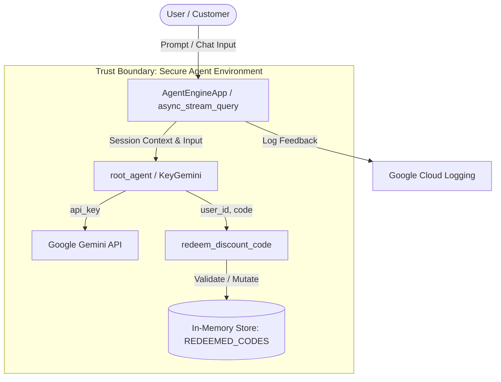

# STRIDE Threat Model Assessment: `shopping-assistant`

This document details the STRIDE threat model assessment for the `shopping-assistant` AI agent workflow.

## 1. System Boundaries & Data Flow

Below is a diagram mapping the trust boundaries, entry points, and data flow of the shopping assistant:

---

## 2. STRIDE Evaluation

| Pillar | Threat Description | Severity | Mitigation Recommendation |
| :--- | :--- | :--- | :--- |
| **S**poofing | Users can claim any `user_id` in their natural language prompts. The system accepts this ID without verifying ownership. | **High** | Authenticate users at the API/endpoint level and inject the verified `user_id` as a context parameter instead of letting the user supply it. |
| **T**ampering | In-memory store (`REDEEMED_CODES`) is volatile. If the container or process restarts, the state is cleared, allowing discount codes to be reused. | **Medium** | Transition to a persistent storage layer (e.g., Cloud SQL or Firestore) with transaction locking. |
| **R**epudiation | Coupon redemptions are only tracked in memory. No permanent, tamper-resistant transaction log is maintained. | **Medium** | Log all successful redemptions to an audit log database (e.g., BigQuery or Cloud Logging with restricted access). |
| **I**nformation Disclosure | The Gemini API key (`AIzaSyD-mock-key-value-12345`) is hardcoded in the codebase ([app/agent.py](file:///C:/Users/ericj/source/agy2-projects/secure-agent-lab/shopping-assistant/app/agent.py)). | **Critical** | Remove the hardcoded API key and retrieve it dynamically from Secret Manager or environment variables (`GEMINI_API_KEY`). |
| **D**enial of Service | The tool lacks rate limits, allowing automated scripts to flood coupon redemption endpoints and exhaust model quota. | **Medium** | Implement rate limiting (e.g., token bucket) on the endpoint level and within the tool. |
| **E**levation of Privilege | Any user who can chat with the agent can invoke the coupon redemption tool with any user ID. | **High** | Restrict tool usage by enforcing role-based access control (RBAC) checked before the agent delegates to the tool. |

---

## 3. Key Remediation Action Items

> [!CRITICAL]
> **Hardcoded API Key**: Remove the simulated key `api_key="AIzaSyD-mock-key-value-12345"` from [app/agent.py](file:///C:/Users/ericj/source/agy2-projects/secure-agent-lab/shopping-assistant/app/agent.py) to prevent accidental credentials exposure and satisfy Semgrep/git security checks.

> [!WARNING]
> **Authentication & Authorization**: Currently, the agent trusts the user's assertion of identity. Secure the API endpoint to inject authenticated user contexts.
